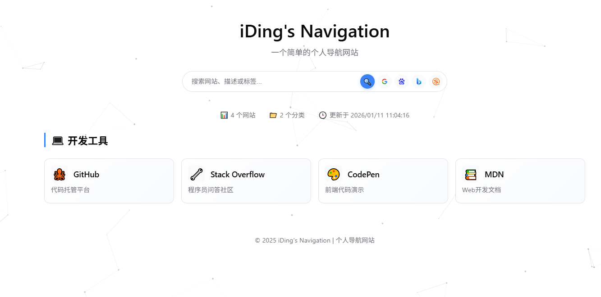
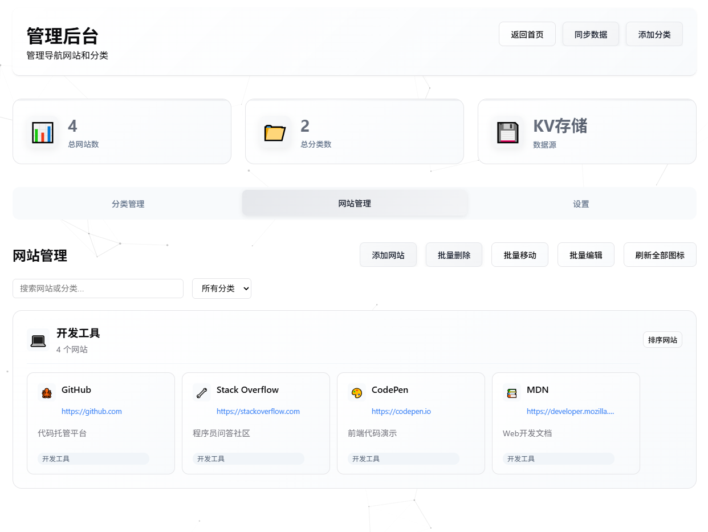
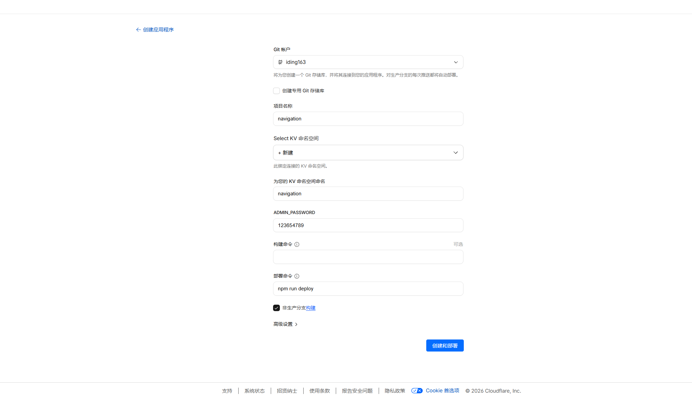
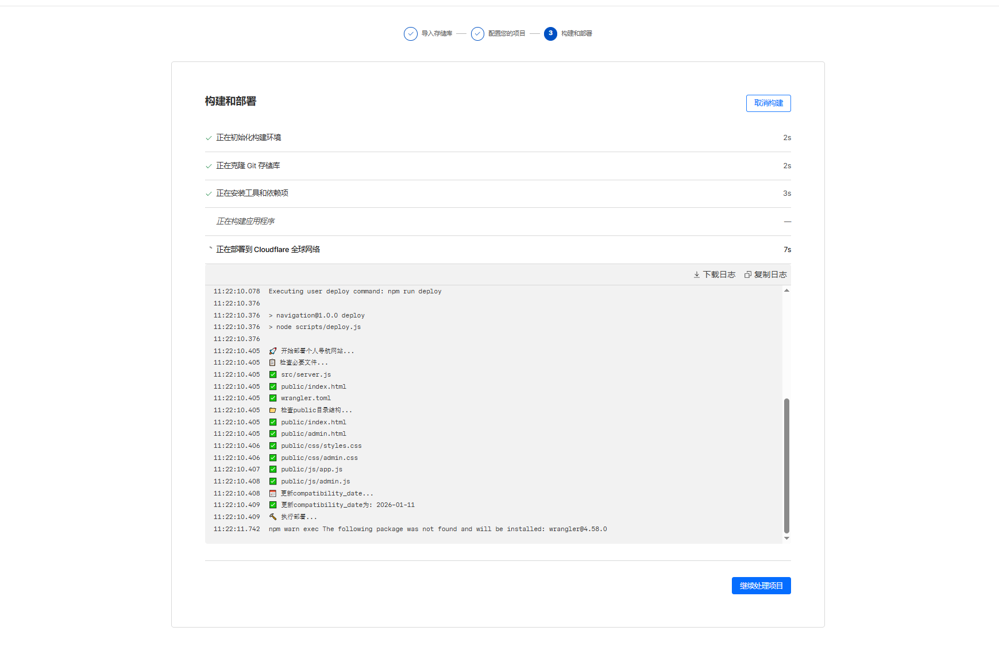
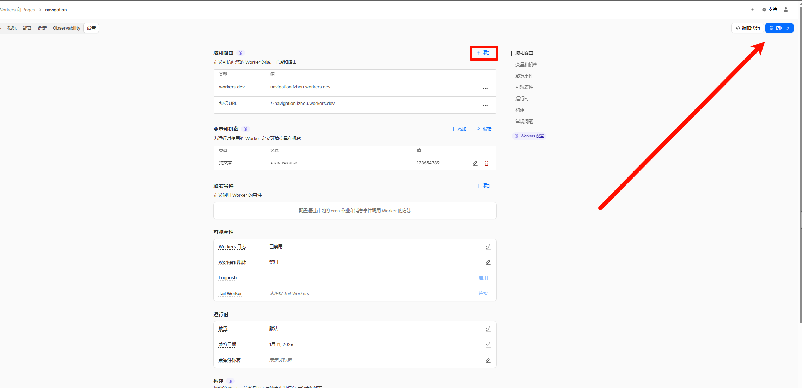

# 个人导航网站

基于原EvanMi网页样式设计的个人导航网站，采用Cloudflare Worker + KV存储架构，支持前后端一体化部署。

## ⚡ 一键部署

[](https://deploy.workers.cloudflare.com/?url=https://github.com/idinging/navigation-bar)

点击上方按钮即可一键部署到 Cloudflare Workers，无需任何配置！

## 体验地址
 **地址**：https://nav.sfkj.de5.net

 **管理地址**：https://nav.sfkj.de5.net/admin

 **管理密码**：admin


## 页面展示
### 首页

### 导航展示

### 管理页面
`tip:管理页面需要手动访问 /admin`



## 🚀 功能特性

- **现代化设计**: 基于原EvanMi网页的精美样式
- **响应式布局**: 完美适配桌面端和移动端
- **实时搜索**: 支持按网站名称、描述、标签搜索
- **主题切换**: 支持明暗主题切换，记忆用户偏好
- **分类管理**: 按功能分类整理网站链接
- **动态背景**: 炫酷的粒子动画背景效果
- **API接口**: 提供完整的RESTful API
- **无服务器**: 基于Cloudflare Worker，无需维护服务器

## 📁 项目结构

```
navigation/
├── src/                           # 源代码目录
│   ├── server.js                  # 主入口文件
│   ├── data/                      # 数据层
│   │   └── navigationData.js      # 导航数据模块
│   ├── handlers/                  # API处理器层
│   │   ├── navigationHandler.js   # 导航API处理器
│   │   ├── sitesHandler.js        # 网站API处理器
│   │   ├── searchHandler.js       # 搜索API处理器
│   │   └── statsHandler.js        # 统计API处理器
│   ├── routes/                    # 路由层
│   │   └── apiRouter.js           # API路由配置
│   └── utils/                     # 工具层
│       ├── responseUtils.js       # 响应工具模块
│       └── assetHandler.js        # 静态资源处理
├── public/                        # 静态资源目录
│   └── index.html                 # 前端页面
├── docs/                          # 文档目录
│   ├── deployment-guide.md        # 部署指南
│   └── project-structure.md       # 项目结构说明
├── wrangler.toml                  # Worker配置文件
├── package.json                   # 项目配置
└── README.md                      # 项目说明
```

## 🛠️ 技术栈

- **前端**: 纯HTML5 + CSS3 + JavaScript ES6+
- **后端**: Cloudflare Worker (JavaScript ES6 模块)
- **架构**: 分层模块化架构 (数据层/处理器层/路由层/工具层)
- **存储**: Cloudflare KV 
- **部署**: Cloudflare Workers Platform

## 📖 一键部署教程

### 方式一：一键部署（推荐）

使用 Cloudflare Workers 一键部署功能，3步完成部署：

#### 步骤 1：点击部署按钮

点击上方的 "Deploy to Cloudflare Workers" 按钮，或访问：
```
https://deploy.workers.cloudflare.com/?url=https://github.com/idinging/navigation-bar
```



#### 步骤 2：授权 GitHub 仓库

- 登录你的 Cloudflare 账号
- 授权访问 GitHub 仓库
- 选择要部署的仓库



#### 步骤 3：完成部署

- 等待自动部署完成
- 获取你的 Worker 访问地址
- 开始使用你的个人导航网站！



部署完成后，你将获得一个类似 `https://your-project.your-subdomain.workers.dev` 的访问地址。

### 方式二：手动部署

## 🔧 快速部署

### 1. 环境准备

确保已安装Node.js和npm，然后安装Wrangler CLI：

```bash
npm install -g wrangler
```

### 2. 登录Cloudflare

```bash
wrangler login
```

### 3. 部署应用

```bash
# 部署到Cloudflare Worker
wrangler deploy

# 或者先预览
wrangler dev
```

### 4. 配置KV存储


```bash
# 创建KV命名空间
wrangler kv:namespace create "NAVIGATION_KV"
wrangler kv:namespace create "NAVIGATION_KV" --preview

# 将返回的ID更新到wrangler.toml中
```

## 🎨 自定义配置

### 修改导航数据

编辑 `src/data/navigationData.js` 中的数据配置：

```javascript
// 修改个人信息
export const profileConfig = {
  name: "Your Navigation",
  subtitle: "你的个人导航网站",
  // ...
};
```
### 自定义样式

修改 `public/index.html` 中的CSS样式，或者添加新的样式规则。

### 主题配置

支持明暗两种主题，通过CSS类 `.dark-theme` 控制：

- 亮色主题：默认样式
- 暗色主题：添加 `.dark-theme` 类

## 🔒 环境变量

在 `wrangler.toml` 中配置环境变量：

```toml
[vars]
ENVIRONMENT = "production"
```

## 🚀 部署到自定义域名

1. 在Cloudflare Dashboard中添加自定义域名
2. 配置Worker路由
3. 更新DNS记录

```bash
# 添加自定义域名
wrangler route add example.com/*
```


## 🛡️ 安全特性

- CORS跨域支持
- 输入验证和过滤
- XSS防护
- 安全的API响应格式

## 🔄 版本更新

```bash
# 更新代码后重新部署
wrangler deploy

# 查看部署状态
wrangler deployments list
```

## 📱 移动端适配

- 响应式栅格布局
- 触摸友好的交互设计
- 移动端优化的搜索体验
- 适配小屏幕的导航展示

## 🎯 性能优化

- 静态资源CDN加速
- 懒加载和虚拟滚动
- 搜索防抖优化
- 缓存策略优化

## 🐛 故障排除

### 常见问题

1. **部署失败**: 检查wrangler.toml配置
2. **API不可用**: 确认Worker部署成功
3. **样式丢失**: 检查静态资源路径
4. **搜索无效**: 确认API接口正常

### 调试命令

```bash
# 本地开发调试
wrangler dev --local

# 查看Worker日志
wrangler tail --format pretty

# 测试API接口
curl https://your-worker.your-subdomain.workers.dev/api/navigation
```

## 📄 许可证

MIT License

## 🤝 贡献

欢迎提交Issue和Pull Request来改进这个项目！

## 📞 支持

如有问题，请创建Issue或联系项目维护者。

---

🌟 如果这个项目对你有帮助，请给个Star支持一下！
